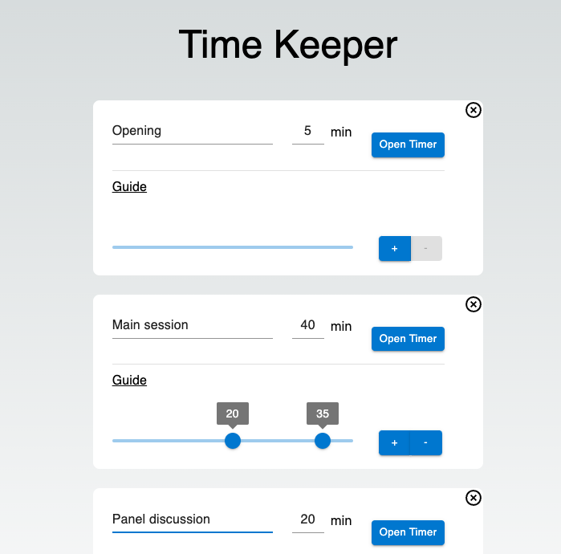
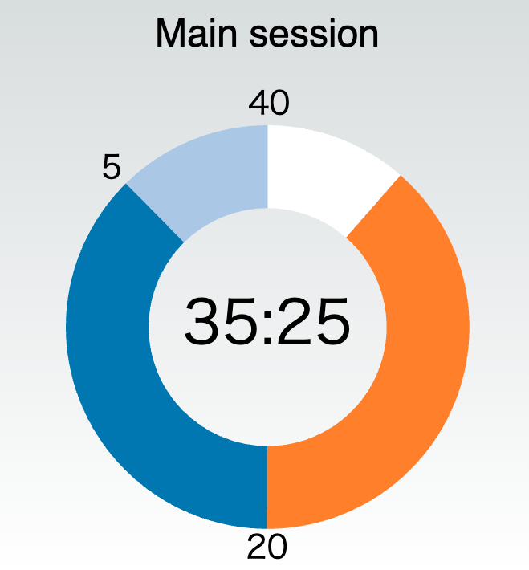
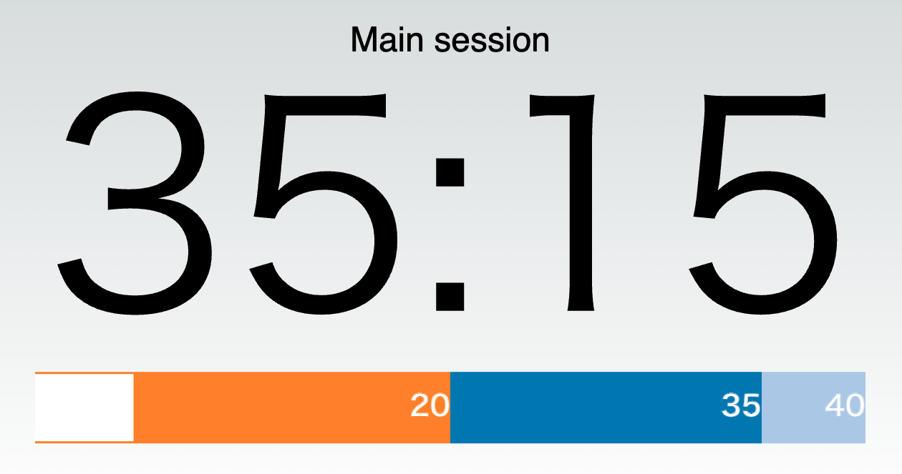

[Time keeper](https://ihgs.github.io/timekeeper/) is a graphical timer for event with multiple sessions.

You can use two types of timer.

### Usage

1. Open a page: https://ihgs.github.io/timekeeper/
2. Set minutes of timer
3. (option) Input a session name and set guides.
4. Click a `Open Timer` button and new browser tab is opened.
5. Click a `START` button.

